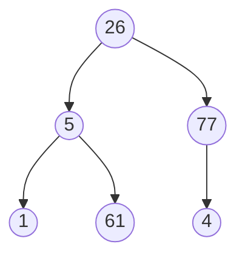
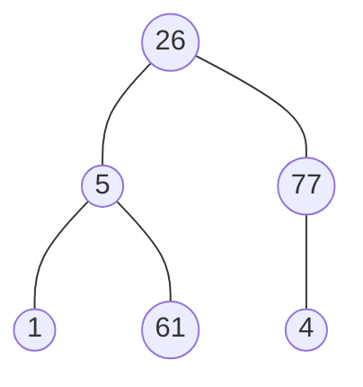
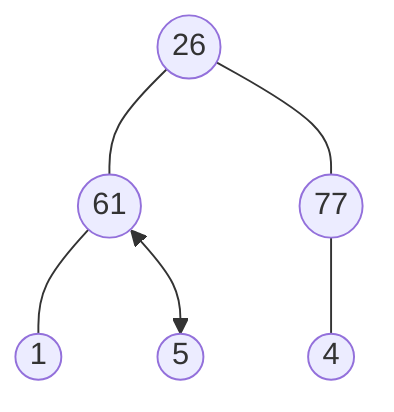
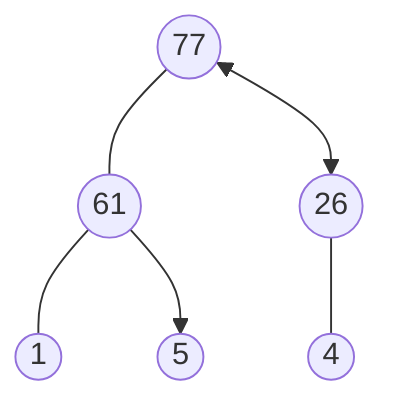
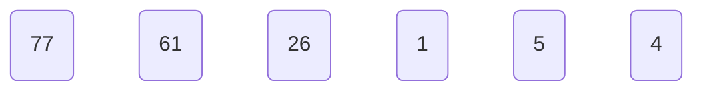
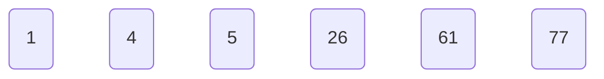

# C++ 堆積 (Heap Sort) 筆記

主要紀錄上課所理解到的內容以及補充一些資料，以下內容可能來自網路、課程資料。  
目前還講的不是很清楚，也可能有些錯誤，如有發現錯誤可以通知!  

## 什麼是堆積？

堆積（Heap）是一種特殊的樹狀數據結構，滿足以下特性：

- 堆積是一棵完全二叉樹。
- 堆積中每個節點的值都大於或等於（最大堆）或小於或等於（最小堆）其子節點的值。
    1. 最大堆積(Max Heap)：父節點的值 > 子節點的值。 Root 會是最大值 。
    2. 最小堆積(Min Heap)：父節點的值 < 子節點的值。 Root 會是最小值 。

## Heap Sort 圖解

- 示範的數字: 26, 5, 77, 1, 61, 4



### 最大堆積(Max Heap)

- heap sort的原理是採用max heap這種資料結構來做排序，max heap是一種binary tree，每個節點都會比自己的子節點還大，因此根節點會是最大值，讓我們先來理解如何實作一個max heap吧!假設現在有一個排序是亂的binary tree如下圖



1. 先從右邊觀察節點，如果父節點是最大值則不用換

2. 接著第三層做遍歷，換左邊3個，父結點 < 子節點，所以61和5互換



3. 當最下層做完後，換第二層做遍歷  



4. 這樣就完成了 max-heap  

## max-heap C++實作實現

```cpp
#include <bits/stdc++.h>
using namespace std;
// 函數用於堆化以節點 i 為根的子樹，i 是 arr[] 中的索引
void heapify(vector<int> &arr, int n, int i)
{
    int largest = i; // 初始化最大值為根
    int left = 2 * i + 1; // 左子節點 = 2*i + 1
    int right = 2 * i + 2; // 右子節點 = 2*i + 2

    // 如果左子節點大於根
    if (left < n && arr[left] > arr[largest])
    {
        largest = left;
    }
    // 如果右子節點大於目前的最大值
    if (right < n && arr[right] > arr[largest])
    {
        largest = right;
    }
    // 如果最大值不是根
    if (largest != i)
    {
        swap(arr[i], arr[largest]); // 交換根與最大值
        heapify(arr, n, largest); // 遞迴堆化受影響的子樹
    }
}
// 主函數進行堆排序
void heapSort(vector<int> &arr)
{
    int n = arr.size();
    // 建立堆（重新排列數組）
    for (int i = n / 2 - 1; i >= 0; i--)
    {
        heapify(arr, n, i);
    }
}
int main()
{
    vector<int> arr = {26, 5, 77, 1, 61, 4}; // 初始化數組
    heapSort(arr); // 調用堆排序
    cout << "sort:\n"; // 打印排序後的數組
    for (int i = 0; i < arr.size(); i++)
    {
        cout << arr[i] << " ";
    }
    cout << endl;
}
```  

### 執行後排序


## 用max-heap 做 heap Sort C++實現
  接下來的工作就是排序啦！由於我們現在已經知道這個結構中的最大值是最頂層的節點，且我們要把陣列做遞增排列。所以我們可以直接把頂層的節點，也就是最大值與陣列的最後一個元素做交換，如此一來我們的遞增排序就已經排好一個元素了  


```cpp
#include <bits/stdc++.h>
using namespace std;

// 函數用於堆化以節點 i 為根的子樹，i 是 arr[] 中的索引
void heapify(vector<int> &arr, int n, int i)
{
    int largest = i; // 初始化最大值為根
    int left = 2 * i + 1; // 左子節點 = 2*i + 1
    int right = 2 * i + 2; // 右子節點 = 2*i + 2

    // 如果左子節點大於根
    if (left < n && arr[left] > arr[largest])
    {
        largest = left;
    }
    // 如果右子節點大於目前的最大值
    if (right < n && arr[right] > arr[largest])
    {
        largest = right;
    }
    // 如果最大值不是根
    if (largest != i)
    {
        swap(arr[i], arr[largest]); // 交換根與最大值
        heapify(arr, n, largest); // 遞迴堆化受影響的子樹
    }
}

// 主函數進行堆排序
void heapSort(vector<int> &arr)
{
    int n = arr.size();

    // 建立堆（重新排列數組）
    for (int i = n / 2 - 1; i >= 0; i--)
    {
        heapify(arr, n, i);
    }
    //這邊主要用於由小排到大
    // 一個一個從堆中提取元素
    for (int i = n - 1; i > 0; i--)
    {
        swap(arr[0], arr[i]); // 將當前根移到數組末尾
        heapify(arr, i, 0);   // 在縮小的堆上調用最大堆化
    }
}

int main()
{
    vector<int> arr = {26, 5, 77, 1, 61, 4}; // 初始化數組
    heapSort(arr); // 調用堆排序
    cout << "sort:\n"; // 打印排序後的數組
    for (int i = 0; i < arr.size(); i++)
    {
        cout << arr[i] << " ";
    }
    cout << endl;
}
```

### 執行後排序  


## 時間複雜度

* 在最差的情況下，時間複雜度是O(n log n)  
* 在最佳的情況下，時間複雜度是O(n)  
* 在平均情況下，時間複雜度為 O(n log n)  

## 堆積的應用

堆積在計算機科學中有多種應用，包括但不限於：

- 優先隊列
- 堆排序
- 圖算法中的最短路徑算法（如Dijkstra算法）

